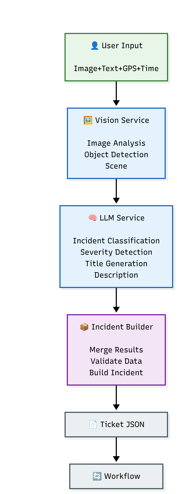

# GeoVision

GeoVision is an AI-powered urban event detection system. It analyzes images submitted by users or field operators, identifies the type of incident, and automatically routes the report to the responsible organization.

## Tech Stack

**Backend**
- Python, FastAPI
- OpenAI GPT-4o Mini (×2 API instances) — image analysis & event classification
- Uvicorn

**Frontend**
- React + Vite
- REST API integration with backend

## System Architecture

---

## Scope of the Demo Version

The current AI model has been trained on a limited dataset. In this version, the following events are detectable:

**Municipality**
- Waste, Debris, Street pothole, Street lighting malfunction, Green space issues

**Security Agencies**
- Security incident, Explosion, Missile/bomb impact site, Suspicious items

**Telecommunications**
- Cable outage, Fiber optic failure, Duct damage, Equipment malfunction

**Water & Wastewater**
- Water leak, Pipe breakage

**Electricity Department**
- Damaged power pole, Power cable outage

**Gas Company**
- Gas leak, Gas line damage

> This scope applies only to the demo training model and does not limit the system architecture.

---

## Important Notes

- This repository contains the demo version delivered to the client.
- The current model has been trained solely to demonstrate the system's capabilities.
- The system architecture is scalable and extensible.
- The final version can be developed according to the client's requirements.
